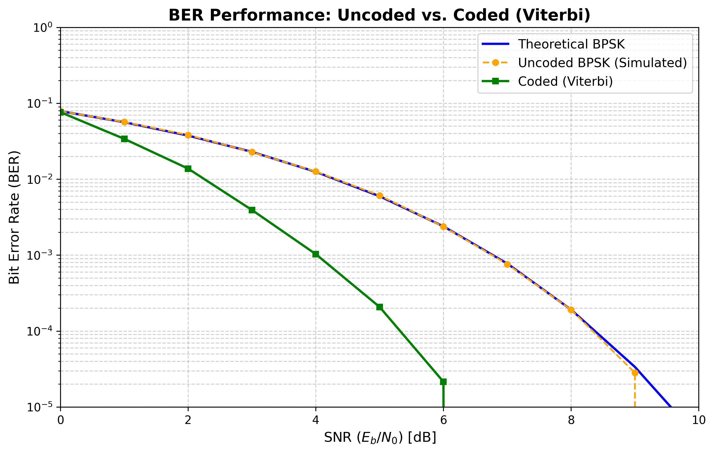
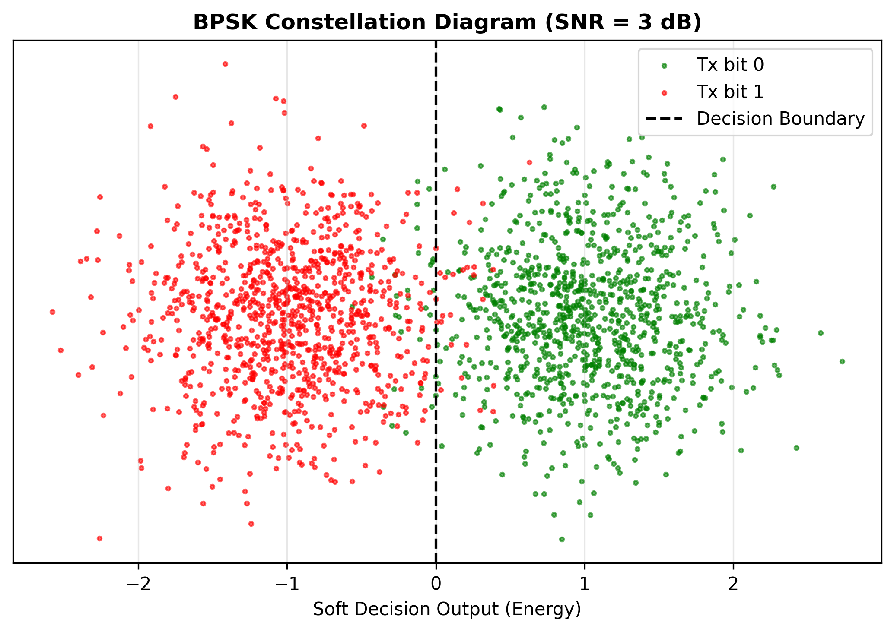

# End-to-End Digital Communication PHY Layer Simulator

**A pure Python implementation of a Digital Communication Physical Layer (PHY), built from first principles.**

## Motivation
I studied the flow of data in a digital communication system through the **"Principles of Communication Systems Part-2"** (NPTEL/YouTube playlist) by **Prof. Aditya K. Jagannatham**.
To bridge the gap between theory and implementation, I decided to simulate the complete pipeline in **Python from scratch**.
The primary goal was to avoid using high-level communication libraries to ensure a strong foundational grasp of the **mathematics and coding logic** essential for future Signal Processing projects.

## Objective
* **BER Performance Analysis:** To compare the Bit Error Rate (BER) vs SNR across three scenarios:
  1. **Theoretical BPSK** (Reference curve).
  2. **Uncoded BPSK** (Simulated raw baseline).
  3. **Coded BPSK** (Convolutional Coding + Viterbi Decoding).
* **Verification:** To observe and verify the expected **~3 dB Coding Gain** achieved by the Rate-1/2 Convolutional Code.
* **Visualization:** To plot the BPSK Constellation diagram to visualize the effect of AWGN on signal phase.

## System Architecture (Signal Flow)
The simulation runs a **Monte Carlo loop (10,000 iterations)** through the following pipeline:

1.  **Source Coding:** The Input Message (Text) is compressed via the **Huffman Encoder** to produce compressed bits.
2.  **Channel Coding:** These bits are processed by the **Convolutional Encoder** to generate coded bits.
3.  **Modulation:** The coded bits are mapped to a **BPSK Modulator** using a Cosine Basis Function to create the waveform.
4.  **Channel:** The waveform passes through an **AWGN Channel** with varying SNR from 0 to 10 dB.
5.  **Receiver:** The signal is processed by a Matched Filter, followed by a **Viterbi Decoder** and a **Huffman Decoder** to reconstruct the message.

## Simulation Results

### 1. BER Performance (Coding Gain Verification)

*The **Coded Viterbi (Green)** curve shows a clear ~3 dB improvement over Uncoded BPSK (Orange) at BER $10^{-4}, validating the decoder logic.*

### 2. BPSK Constellation Visualization

Visualizing the noise variance and decision boundaries for soft-decision decoding.*

## Quick Start
**Dependencies:** `numpy`, `matplotlib`, `scipy` (exclusively for theoretical `erfc` reference).

# 1. Clone & Enter
```bash
git clone https://github.com/SanathTyagi/End-to-End-Communication-Link.git
cd End-to-End-Communication-Link
```
# 2. Run Simulation
```bash
python Main.py
```


## Future Plans
* **Higher-Order Modulation:** Extend the simulator to support **QPSK** and **16-QAM** to analyze bandwidth efficiency.
* **Information Theoretic Analysis:** Implement modules to calculate **Mutual Information** and verify **Shannon's Channel Capacity** limit for the AWGN channel.
* **Channel Realism:** Move beyond the ideal **AWGN Channel** to study the effects of **Multipath Fading** and interference on signal integrity.
